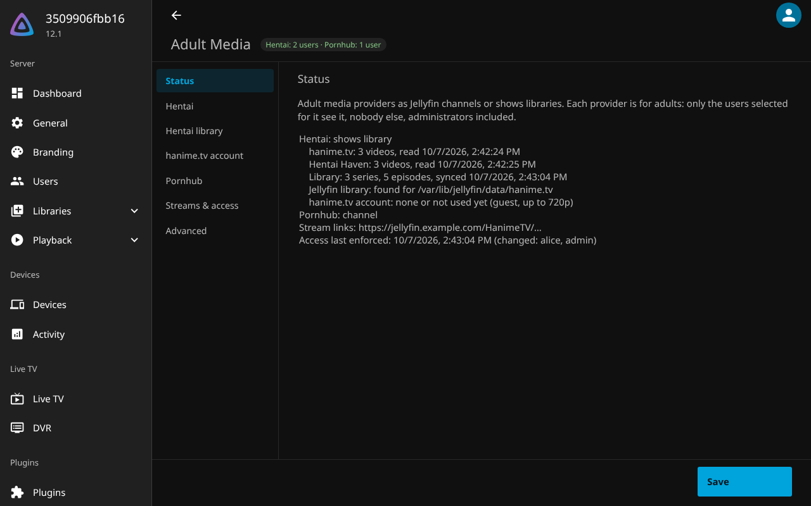
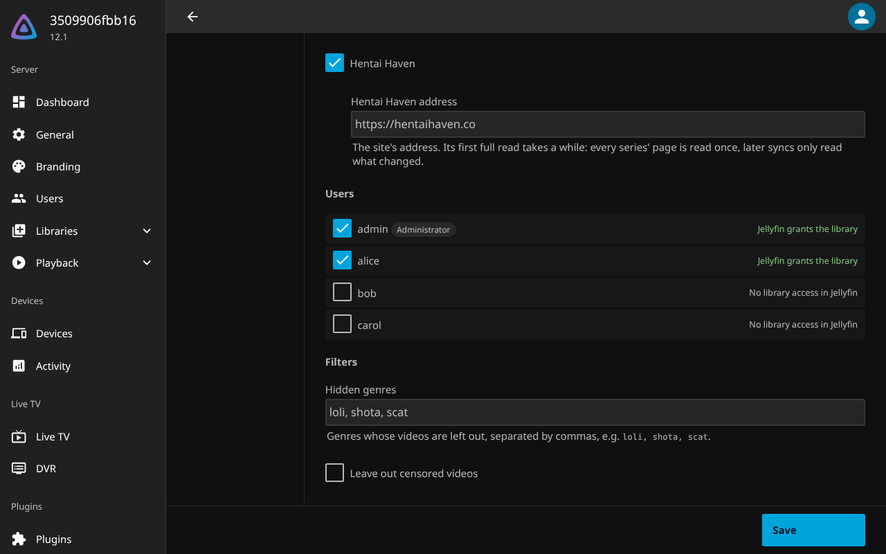

# hanime.tv for Jellyfin


Watch [hanime.tv](https://hanime.tv) in Jellyfin as a shows library that only the users you
select can see. Every video becomes an episode of its series, with hanime.tv's description,
genres, studio, release date and images, and plays through Jellyfin on every client.

## Features

- **A real shows library:** series, seasons and episodes, with Next Up, Continue Watching,
  search, favorites, collections and metadata editing like any other show.
- **Metadata from hanime.tv:** titles, descriptions, genres, studios, release and upload dates,
  ratings, covers and thumbnails.
- **Only for selected users:** the library is invisible to everyone else, administrators
  included, through Jellyfin's own library access. A new installation selects nobody.
- **Stays current:** new uploads appear and removed videos disappear on every sync (every 6
  hours, or on demand).
- **Plays everywhere:** the plugin serves hanime.tv's streams through Jellyfin, so clients
  never contact hanime.tv.
- **Filters:** leave out genres (e.g. `loli, shota, scat`) and censored videos.
- **Parental controls:** the series and episodes are rated `XXX`.
- **Optional account:** guests get up to 720p; a premium hanime.tv account adds 1080p.
- **Updates through the plugin catalog.**

## Screenshots

The settings page, with the library's state:



The user selection, with the access Jellyfin grants each user:



## Requirements

- **Jellyfin 12.1 or newer** on any platform.
- hanime.tv reachable from the Jellyfin server. hanime.tv refuses many datacenter and VPN
  addresses (HTTP 403 in *Test*); a server at home usually works. Otherwise, point the
  endpoints under *Advanced* at a relay.

## Installation

1. In Jellyfin, open *Dashboard → Plugins → Manage Repositories* and add this repository:
   ```
   https://raw.githubusercontent.com/CrystalNET-org/Jellyfin.Plugin.HAnimeTV/main/manifest.json
   ```
2. Install **hanime.tv** from the catalog (category *Anime*) and restart Jellyfin.
3. Open **hanime.tv** in the dashboard sidebar, below *Plugins*, and click **Test**.
4. Under **Library**, check *Jellyfin address for the stream links* (see below).
5. Under **Users**, tick the users who may see the library, and save.

The plugin then writes the library's files, creates the **hanime.tv** shows library and has
Jellyfin scan it. With the full catalog (about 3400 videos in 1500 series) the first scan takes
a few minutes.

To install without the catalog, extract a
[release](https://github.com/CrystalNET-org/Jellyfin.Plugin.HAnimeTV/releases) zip into a
folder in Jellyfin's `plugins` directory.

## How it works

On every sync the plugin downloads hanime.tv's catalog and writes it into a folder, laid out
like any shows library:

```
hanime.tv/
└── Ishuzoku Reviewers/
    ├── tvshow.nfo                        series: title, description, genres, studio, cover
    └── Season 01/
        ├── Ishuzoku Reviewers S01E01.strm    the episode's stream link
        ├── Ishuzoku Reviewers S01E01.nfo     episode: title, description, dates, rating, image
        └── …
```

Episodes are grouped into series by their names: "Title 2" is episode 2 of "Title". Only
changed files are written, so Jellyfin rescans only what changed.

A `.strm` file holds a link to the plugin on your Jellyfin server, not to hanime.tv, because
hanime.tv's stream links expire and need a browser's headers. When an episode plays, the plugin
asks hanime.tv for a fresh stream and serves it through Jellyfin. Browsers that can play HLS
play that link themselves; other clients get it remuxed or transcoded by Jellyfin.

## Settings

| Section | Setting | Default | Meaning |
| --- | --- | --- | --- |
| Users | users | nobody | Who sees the library and can play its videos. |
| Users | Enforce through the users' library access | on | See *How access is enforced*. |
| Library | Folder | `hanime.tv` in Jellyfin's data directory | Where the files are written. Use an empty folder: the plugin replaces everything in it. |
| Library | Create the Jellyfin library | on | Creates a shows library for the folder if there is none. |
| Library | Library name | hanime.tv | |
| Library | Jellyfin address for the stream links | this page's address | See below. |
| Catalog | Hidden genres | none | hanime.tv tags whose videos are left out, separated by commas. |
| Catalog | Leave out censored videos | off | |
| Catalog | Catalog refresh | 6 hours | How long the catalog is kept before it is downloaded again. |
| Account | Email, password | empty | Optional hanime.tv account; premium adds 1080p. After a failed login, videos play as a guest and the login is retried after 15 minutes. |
| Advanced | Catalog, handshake and login URL, stream host | hanime.tv | To use a relay. |

**Jellyfin address for the stream links:** the address in the `.strm` files. Jellyfin's ffmpeg,
and every ffmpeg worker, starts streams from it, and browsers fetch these links themselves, so
it must be the address your clients open Jellyfin with, e.g. `https://jellyfin.example.com` (an
`http://` address on an `https://` site is blocked by browsers), and reachable from all ffmpeg
workers. The settings page fills in its own address; save to use it. After changing it, the
next sync rewrites the links. Left empty, the links use Jellyfin's guess of its own address,
which the *Status* section flags.

**In Kubernetes**, use the ingress address. Jellyfin's guess is the pod's IP, which changes with
every restart and which ffmpeg workers outside the cluster cannot reach (ffmpeg fails with
`Connection to tcp://10.244.…:8096 failed: Connection timed out`). Through the ingress, every
worker, inside or outside the cluster, reaches the same address as the browsers.

**Test** checks the settings as entered, before saving them: it downloads the catalog and asks
for the streams of the newest video.

The library the plugin creates reads only the plugin's NFO files: no internet metadata
providers, no trickplay or chapter images (which would run ffmpeg over every stream). You can
change that under *Dashboard → Libraries*, e.g. to add the AniDB plugin's metadata.

## How access is enforced

With *Enforce through the users' library access* on, the library access in each user's policy
(*Dashboard → Users → user → Access*) follows the selection, so Jellyfin itself hides the
library and its episodes from everyone else, also by id and for playback.

The policies are brought in line after every sync, when the settings are saved, when a user is
created, and every 15 minutes (scheduled task *Enforce hanime.tv library access*); the *Users*
section also has **Apply access now**. A user who is not selected but had *Enable access to all
libraries* keeps every other library: they are listed one by one instead. Jellyfin reports no
changes to a user's access, so if an administrator grants such a user all libraries again, the
plugin takes the library away again at its next check.

Turning enforcement off leaves the policies as they are.

The stream links carry a secret token of the plugin. It only allows streaming hanime.tv's videos
through your server, and users who can see the library can read it.

## Troubleshooting

- **Test fails with HTTP 403:** hanime.tv refuses the server's address, which is common for
  datacenters and VPNs. Run Jellyfin from another network or use a relay (*Advanced*).
- **The library is empty:** look at the *Status* section: the last sync's error, or whether the
  Jellyfin library exists. Jellyfin's log has details (search for `hanime.tv`).
- **Playback fails in the browser but works in apps:** the stream links' address is not
  reachable from the browser, or is `http://` while Jellyfin is opened with `https://`. Set
  *Jellyfin address for the stream links* to the address you open Jellyfin with.
- **ffmpeg fails with `Connection to tcp://…:8096 failed`:** the ffmpeg workers cannot reach the
  stream links' address, e.g. a pod IP. Set *Jellyfin address for the stream links* (see
  *Settings*, *In Kubernetes*).
- **Playback fails everywhere:** click **Test**: hanime.tv may have changed its stream API.
- **An episode is in the wrong series:** series come from the episode names. Edit the episode's
  metadata in Jellyfin, or report the title.
- **Durations show only after playing:** Jellyfin reads a `.strm` episode's duration when it is
  first played, not during scans, so that scans don't hit hanime.tv thousands of times.

## Upgrading from 0.1.x

Versions before 0.2 showed hanime.tv as a channel. The channel is gone; its watched states do
not carry over. Users who were not selected for the channel had their *channel* access changed
to a list of all other channels; check *Enable access to all channels* again under
*Dashboard → Users → Access* if you want them to have it.

## Disclaimer

This plugin is not affiliated with hanime.tv. It uses hanime.tv's unofficial web API, which
can change at any time. The content is for adults only; you are responsible for complying with
the laws of your country and hanime.tv's terms.

## Contributing

See [CONTRIBUTING.md](CONTRIBUTING.md) for building, tests and releases, and
[SECURITY.md](SECURITY.md) for reporting security problems.
